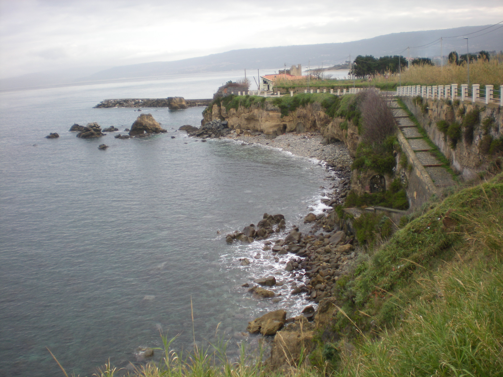

[]() 
[](LICENSE) 


[]()

# Cyclegan pretrained
A pretrained cyclegan

|Original|Monet|Cezanne|Van Gogh|
|:---:|:---:|:---:|:---:|
|||||

## How to use
```python
net = cyclegan(pretrained='cezanne', **{'topN': 6, 'device':'cpu', 'num_classes': 200})
```

## How to train

```bash
EPOCHS=200
DATASET="/path/to/datasets/cezanne2photo"
OUTPUT="/path/to/Models/cyclegan/cezanne"
GPU=1
CUDA_VISIBLE_DEVICES="${GPU}" python3 train.py --n_epochs="${EPOCHS}" --dataroot="${DATASET}" --output-folder="${OUTPUT}"
```